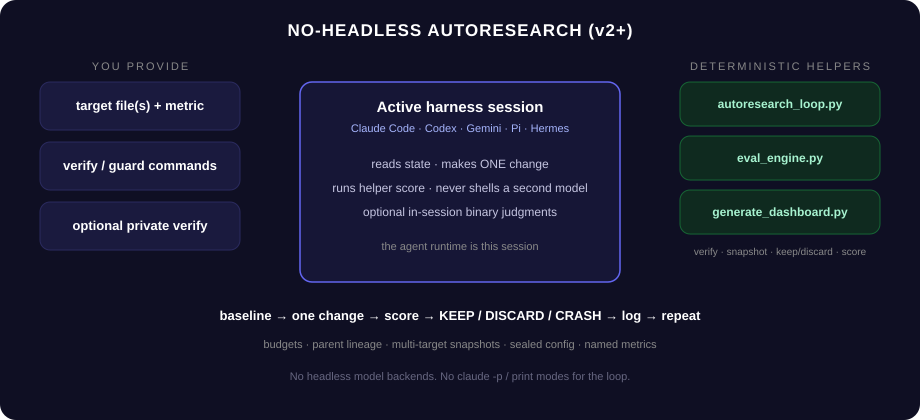
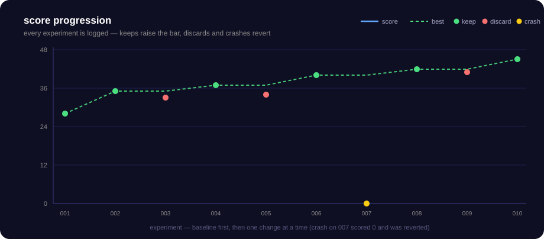

# 🔬 claude-code-autoresearch

**Turn Claude Code, Hermes, or any agent CLI into a measured self-improvement engine.**

[](https://github.com/mjenkinsx9/claude-code-autoresearch/actions/workflows/ci.yml)
[](tests/)
[](scripts/)
[](https://github.com/mjenkinsx9/claude-code-autoresearch/actions/workflows/ci.yml)
[](https://docs.anthropic.com/en/docs/claude-code)
[](https://nousresearch.com/)
[](https://github.com/karpathy/autoresearch)
[](LICENSE)

<p align="center">
  
</p>

> *Set the GOAL → the agent runs the LOOP → you wake up to results.*
> You don't need AGI. You need a goal, a metric, and a loop that never quits.

---

## ✨ What it does

Give it a file to optimize, a way to measure quality, and a goal — then walk away. The agent runs controlled experiments: **modify → verify → score → keep the winners → revert the losers → log → repeat**, indefinitely or for a bounded number of experiments. It never pauses to ask permission mid-loop; every decision is mechanical.

| Goal | Eval approach | Example |
|------|--------------|---------|
| Skill routing accuracy | Binary criteria judged by an LLM | 62% → 90% routing accuracy |
| Test coverage | `npm test --coverage` parsed to % | 72% → 85% coverage |
| API latency | Benchmark script outputs ms | 240ms → 180ms p99 |
| Email response rates | LLM judges CTA + tone | Yes-answers compound over runs |
| Bundle size | Build script outputs KB | 420KB → 310KB |

---

## 🚀 Quick start

**1. Install**

```bash
git clone https://github.com/mjenkinsx9/claude-code-autoresearch.git

# Claude Code global skill install
cp -r claude-code-autoresearch ~/.claude/skills/autoresearch

# Hermes local install
mkdir -p ~/.hermes/skills/autoresearch
cp -r claude-code-autoresearch/* ~/.hermes/skills/autoresearch/
```

**2. Run**

```text
/autoresearch
Goal: Improve my skill routing accuracy from 62% to 90%
```

The agent reads the skill, establishes a baseline, and starts iterating — one change at a time, auto-reverting on failure.

**3. Or drive the Python runner directly**

```bash
# Claude Code backend (default), bounded run with a regression guard
python scripts/autoresearch_loop.py \
  --target target.md \
  --program program.md \
  --eval-config eval.json \
  --guard "npm test" \
  --max-experiments 10

# Hermes backend
python scripts/autoresearch_loop.py \
  --target target.md --program program.md --eval-config eval.json \
  --agent-backend hermes --max-experiments 5

# Any custom agent CLI — the command just has to print the response to stdout
python scripts/autoresearch_loop.py \
  --target target.md --program program.md --eval-config eval.json \
  --agent-backend custom \
  --agent-command 'my-agent --prompt-file {prompt_file}'
```

---

## 🔁 How it works

<p align="center">
  
</p>

You provide three things; the loop owns everything else:

| Component | What it is | Who creates | Who edits |
|-----------|-----------|-------------|-----------|
| **Target file** | The artifact being improved (skill, prompt, doc, code) | You | The agent, during experiments |
| **program.md** | Strategy, constraints, and scope | You | You only — read-only for the agent |
| **eval.json** | Binary yes/no criteria + test prompts | You (+ agent help) | Fixed during a run |

Each experiment: the agent proposes **one focused change**, the runner applies it, executes the test prompts, scores the outputs, and decides:

- **Score improved** → keep (the new bar to beat)
- **Score tied but the target got simpler** → keep
- **Score worse** → revert to the previous kept state
- **Crash or judge failure** → revert, log as `crash`
- **Guard command fails** → revert, even if the score improved

---

## 🎯 Eval modes

### Mechanical — a command outputs a number

> Mechanical mode is for agent-driven loops (Claude Code/Hermes following this skill's protocol). The bundled Python runner (`scripts/autoresearch_loop.py`) currently implements Binary Eval Mode only.

```bash
npm test -- --coverage          # coverage %
python benchmark.py             # ops/sec, latency
./validate.sh                   # → "Score: 72"
```

Use this when the signal is objective: coverage, latency, bundle size, pass count.

### Binary eval — an LLM judges yes/no criteria

Score = yes-answers across all criteria × test prompts × runs. No scales, no "rate 1–10" — binary questions give clean signal.

```json
{
  "criteria": [
    {"id": 1, "question": "Does the output follow the requested format?"},
    {"id": 2, "question": "Does it avoid placeholder text?"},
    {"id": 3, "question": "Would this be usable without more edits?"}
  ],
  "test_prompts": [
    "Summarize a 5-file PR into release notes",
    "Explain a failed CI run from a log excerpt"
  ]
}
```

```bash
python scripts/eval_engine.py --eval-config eval.json --output-dir ./outputs/
```

See [references/eval-criteria-guide.md](references/eval-criteria-guide.md) for how to write criteria that can't be gamed.

---

## 🛡️ Guardrails

The loop is autonomous, so the safety has to be structural:

| Guardrail | What it does |
|-----------|-------------|
| **Baseline gate** | Refuses to start (exit 2) if the baseline runs crash or the judge errors — no optimizing against a broken measurement |
| **One change per iteration** | Atomic experiments; if it breaks, you know exactly why |
| **Auto-revert** | Worse, crashed, and judge-error experiments restore the previous kept state |
| **`--guard "<command>"`** | A command that must always exit 0 (e.g. `npm test`) — validated at startup, run before any keep |
| **Crash stop** | 5 consecutive crashed experiments abort the loop instead of burning tokens all night |
| **Path sandbox** | `--allowed-root` confines the target; `.py` targets additionally require `--allow-exec` |
| **Judge isolation** | Outputs under evaluation are delimited as untrusted data so the target can't instruct its own judge |

---

## 📊 What you wake up to

<p align="center">
  
</p>

```text
autoresearch-results/
├── results.tsv        ← the research log (the most valuable output)
├── snapshots/         ← target state after every experiment
├── backups/           ← pre-experiment state for instant revert
└── runs/              ← raw outputs + per-experiment eval details
```

```tsv
experiment  score  max_score  status   description                              timestamp
001         28     48         keep     baseline — original target file          2026-06-10T08:00:00
002         35     48         keep     added explicit CTA instruction           2026-06-10T08:14:02
003         33     48         discard  word limit broke tone                    2026-06-10T08:31:40
```

The optimized file is a snapshot; the **log is a map of the entire optimization landscape** — what worked, what didn't, and why. When a better model comes along, hand it the log and it picks up where you left off, skipping the dead ends. Render it any time:

```bash
python scripts/generate_dashboard.py --results autoresearch-results/results.tsv --output dashboard.html
```

---

## 🗂️ Repository layout

```text
claude-code-autoresearch/
├── SKILL.md                          ← the skill: protocol, modes, backends
├── assets/                           ← animated diagrams used in this README
├── examples/                         ← ready-made eval configs (skill / prompt / code)
├── references/
│   ├── autonomous-loop-protocol.md   ← the full iteration protocol
│   ├── core-principles.md            ← 7 principles from Karpathy's autoresearch
│   ├── eval-criteria-guide.md        ← writing binary criteria that resist gaming
│   ├── plan-workflow.md              ← /autoresearch-plan interview wizard
│   ├── security-workflow.md          ← /autoresearch-security STRIDE + OWASP loop
│   ├── program-template.md           ← program.md template
│   └── results-logging.md            ← results.tsv schemas
├── scripts/
│   ├── autoresearch_loop.py          ← the experiment engine
│   ├── agent_cli.py                  ← Claude Code / Hermes / custom backend adapter
│   ├── eval_engine.py                ← binary yes/no judge
│   └── generate_dashboard.py         ← HTML dashboard from results.tsv
└── tests/                            ← pytest suite incl. end-to-end loop smoke tests
```

---

## ⚠️ Rules the loop lives by

1. **One change per iteration** — stacked changes can't be attributed.
2. **Mechanical verification only** — "looks better" kills autonomous loops.
3. **Failed experiments are data** — log every discard and crash.
4. **Simplicity wins ties** — equal score + less content = keep.
5. **Never pause mid-loop** — the human may be asleep. That's the point.
6. **Preserve `results.tsv`** — never delete or overwrite the log.

---

## 💻 Requirements

| Component | Requirement |
|-----------|-------------|
| Python | 3.10+ (scripts are stdlib-only — no runtime dependencies) |
| Agent CLI | `claude` (Claude Code), `hermes`, or any command that prints a response to stdout |
| Platform | Linux, Windows, macOS — CI runs the suite on Linux + Windows |
| Dev/testing | `pip install -r requirements-dev.txt` (pytest) |

---

## 🧪 Testing

```bash
python -m pytest tests/
```

15 tests, including end-to-end smoke tests that run the real loop through a deterministic stub agent: a bounded keep/discard run, a broken-backend baseline abort, and a consecutive-crash stop. [CI](.github/workflows/ci.yml) runs the suite on ubuntu + windows × Python 3.10/3.12.

---

## 📚 Documentation map

| Read this | When |
|-----------|------|
| [SKILL.md](SKILL.md) | Using the skill from Claude Code or Hermes |
| [references/autonomous-loop-protocol.md](references/autonomous-loop-protocol.md) | Running the core loop manually |
| [references/plan-workflow.md](references/plan-workflow.md) | Turning a vague goal into a validated run config |
| [references/eval-criteria-guide.md](references/eval-criteria-guide.md) | Writing eval criteria |
| [references/security-workflow.md](references/security-workflow.md) | Security-audit mode |
| [references/results-logging.md](references/results-logging.md) | Log schemas + management |
| [tests.md](tests.md) | Manual verification scenarios |

---

## 🤝 Credits

- **[Andrej Karpathy](https://github.com/karpathy)** — for [autoresearch](https://github.com/karpathy/autoresearch), the constraint + metric + loop blueprint
- **[Anthropic](https://anthropic.com/)** — for [Claude Code](https://docs.anthropic.com/en/docs/claude-code) and the skills system
- **[Nous Research](https://nousresearch.com/)** — for the Hermes Agent CLI backend

## 📄 License

MIT — see [LICENSE](LICENSE).
